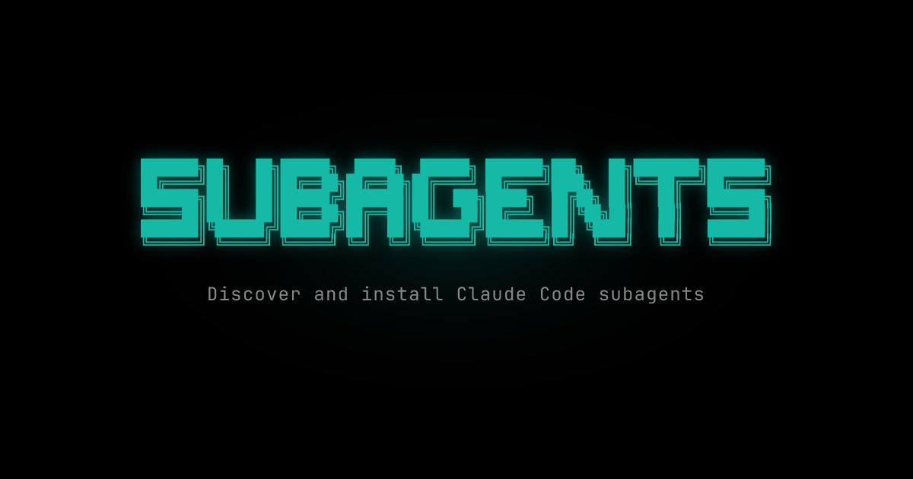

<p align="center">
  
</p>

[](https://opensource.org/licenses/MIT)
[](https://typescriptlang.org)
[](https://nextjs.org)

A discovery platform for [Claude Code](https://claude.ai/code) sub-agents. Browse, install, and share specialized AI agents that enhance your development workflow.

**[subagents.sh](https://subagents.sh)**

---

## Quick Start

Install any subagent with a single command:

```bash
npx subagents-sh add owner/repo/agent-name
```

The agent is saved to `.claude/agents/` and automatically used by Claude Code when relevant.

### CLI Reference

| Command | Description |
|---------|-------------|
| `npx subagents-sh add owner/repo/name` | Install a subagent |
| `npx subagents-sh list` | List installed subagents |
| `npx subagents-sh remove name` | Remove a subagent |
| `npx subagents-sh update` | Update all subagents |

---

## Publishing Subagents

Create a markdown file with YAML frontmatter:

```markdown
---
name: my-agent
description: What this agent does
tools:
  - Read
  - Write
  - Bash
---

Your agent instructions here...
```

Host it on GitHub in one of these locations:
- `.claude/agents/` (recommended)
- `agents/`
- Repository root

Users install directly from your repo:

```bash
npx subagents-sh add your-username/your-repo/agent-name
```

Your agent appears on the [leaderboard](https://subagents.sh) as people install it.

### Frontmatter Fields

| Field | Required | Description |
|-------|----------|-------------|
| `name` | Yes | Agent identifier |
| `description` | No | Brief description for listings |
| `tools` | No | Claude Code tools the agent uses |

---

## Development

### Prerequisites

- Node.js 18+
- Supabase CLI

### Setup

```bash
git clone https://github.com/augmnt/subagents.sh.git
cd subagents.sh
npm install
cp .env.example .env.local
# Edit .env.local with your credentials
npm run dev
```

### Environment Variables

```env
NEXT_PUBLIC_SUPABASE_URL=your_supabase_url
NEXT_PUBLIC_SUPABASE_ANON_KEY=your_supabase_anon_key
SUPABASE_SERVICE_ROLE_KEY=your_service_role_key
GITHUB_TOKEN=your_github_token
```

### Scripts

| Script | Description |
|--------|-------------|
| `npm run dev` | Start development server |
| `npm run build` | Build for production |
| `npm run test` | Run tests |
| `npm run lint` | Lint code |

### Tech Stack

- [Next.js 14](https://nextjs.org) - React framework
- [TypeScript](https://typescriptlang.org) - Type safety
- [Tailwind CSS](https://tailwindcss.com) - Styling
- [shadcn/ui](https://ui.shadcn.com) - UI components
- [Supabase](https://supabase.com) - Database & auth
- [Vercel](https://vercel.com) - Deployment

---

## Contributing

1. Fork the repository
2. Create a feature branch: `git checkout -b feat/my-feature`
3. Commit changes: `git commit -m "feat: add my feature"`
4. Push to your fork: `git push origin feat/my-feature`
5. Open a Pull Request

See [CONTRIBUTING.md](./CONTRIBUTING.md) for detailed guidelines.

---

## License

MIT License - see [LICENSE](./LICENSE) for details.

---

Built by [augmnt](https://augmnt.sh)
